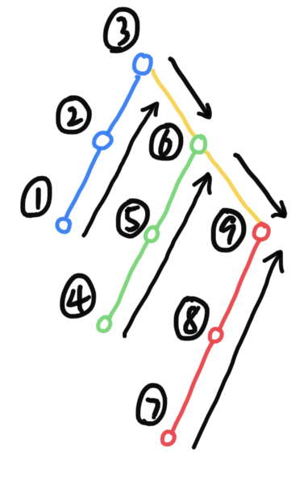

# 矩阵的压缩存储

## 对称阵

对于如下矩阵：


以深灰色为对称轴，由于矩阵内数据对称，因此只需要将任意一边的数据存储起来即可。

需要存储的元素为：


各个元素对应在一维数组中的位置示意图：


### 矩阵坐标转换数组坐标

数组坐标 $k=$ 矩阵元素 $a_{ij}$ 上面的 $i-1$ 行的元素个数 $+$ 当前行前面的元素个数（注意矩阵从 $a_{11}$ 开始计数）

**前 i -1 行的元素个数**

等差数列求和，$a_1=1,a_n=i-1,n=i-1$ （每行的元素个数就是它的行序）

$S_n = \dfrac{(a_1+a_n)n}{2}=\dfrac{i(i-1)}{2}$

**当前行前面的元素个数**

$j-1$

因此，可以得到 $k=\dfrac{i(i-1)}{2}+j-1$

上面的公式存储的是下三角的元素。对于上三角的元素，由于 $a_{ij}=a_{ji}$，因此上三角的元素位置公式可以将上式中的 $i$ 与 $j$ 互换得到。即 $k_{上三角}=\dfrac{j(j-1)}{2}+i-1$

## 三角矩阵

采用和对称阵相同的存储方式存储。

## 稀疏矩阵

只存储非零元，非零元的个数以及矩阵的大小。非零元通过 `(行标, 列标, 值)` 的三元组存储。

### 三元组顺序表

```c
typedef struct {
  int i, j;
  int val;
} Triple;

typedef struct {
  Triple data[number]; //三元组数组
  int n, m;            //矩阵的行数和列数
  int num;             //非零元个数
} TSMatrix;
```

### 行逻辑链接的顺序表

三元组顺序表每次提取指定元素都要遍历整个数组，效率很低。因此提出了三元组顺序表的升级版——行逻辑链接的顺序表。

行逻辑链接的顺序表在三元组顺序表的基础上加入了一个用于记录矩阵中每行的首非零元在三元组数组中的位置的数组。

```c
typedef struct {
  Triple data[MAXSIZE + 1];
  int rpos[MAXRC + 1];
  int n, m;
  int num;
} RLSMatrix;
```


对于上面的矩阵，采用行逻辑链接的顺序表存储时，需要做两个工作：

1. 将矩阵中的非零元存储到三元组数组。


2. 使用数组 rpos 记录矩阵中每行的首非零元在 data 中的位置。


这样，当我们提取元素时，就可利用 rpos 数组定位要访问的位置区间来提高效率。

```c
void display(RLSMatrix M)
{
  for (int i = 1; i <= M.m; ++i)
  {
    for (int j = 1; j <= M.n; ++j)
    {
      int flag = 0; //标记某位置是否为非零元
      if (i + 1 <= M.m) //如果不是最后一行
      {
        for (int k = M.rpos[i]; k < M.rpos[i + 1]; ++k) //通过 rpos 数组定位这一行在三元组中的位置
        {
          if (i == M.data[k].i && j == M.data[k].j) //如果在该位置有非零元
          {
            printf("%d ", M.data[k].val);
            flag = 1;
            break;
          }
        }
        if (flag == 0) //没有遇到非零元
        {
          printf("0 ");
        }
      }
      else //最后一行
      {
        for (int k = M.rpos[i]; k <= M.num; ++k) //定位
        {
          if (i == M.data[k].i && j == M.data[k].j) //遇到非零元
          {
            printf("%d ", M.data[k].e);
            flag = 1;
            break;
          }
        }
        if (flag == 0)
        {
          printf("0 ");
        }
      }
    }
    printf("\n"); //每行输出完输出一个换行
  }
}
```

> [行逻辑链接的顺序表](http://c.biancheng.net/view/3372.html)

### 十字链表法

为解决数组不便于插入或删除的问题，提出了十字链表法。

> [十字链表法详解](http://c.biancheng.net/view/3373.html)

# 稀疏矩阵的转置算法

转置：$a_{i,j}=a_{j,i}$

对于使用三元组顺序表或行逻辑链接的顺序表存储的矩阵，在转置时需要完成以下三步：

1. 将矩阵的行数 m 和列数 n 互换。
2. 将三元组表中每个元素的 i 和 j 互换。
3. 重新排列三元组表中的元素顺序。

**简单实现思路：不断遍历存储矩阵的三元组表，每次都从中取出 j 最小的那一个元素（如果有多个，则按照他们原来在三元组中的次序依次取出），互换 i 和 j，然后存储到一个新的三元组表中**


该算法的时间复杂度为 $O(n^2)$

> [稀疏矩阵的转置算法](http://c.biancheng.net/view/3374.html)

# 树

## 树的常用定理

度
: 一个结点含有的子结点的个数
: 二叉树中的度指的是出度

1. 所有结点的度数之和是边数的 2 倍（这里的度是指一般的度）
2. 树中的边数等于结点数减 1

## 二叉树

### 二叉树的遍历

> [二叉树先序遍历](http://c.biancheng.net/view/3388.html)

确定了二叉树的遍历方式，就相当于确定了一个将二叉树转换为线性表的规则。

> 任何二叉树都可由中序序列和另一个序列唯一确定

### 线索二叉树

```c
typedef enum {Link, Thread} PointerTag; //指示指针域存储的是孩子还是前驱后继的枚举

typedef struct BiThrNode {
    TElemType data; //数据域
    struct BiThrNode *lchild, *rchild; //左、右孩子指针域
    PointerTag Ltag, Rtag; //标志域
} BiThrNode, *BiThrTree;
```

#### 对二叉树进行线索化

```c
//中序对二叉树进行线索化
void InThreading(BiThrTree node) {
    static BiThrNode* pre = NULL; //上一次访问的结点，即前驱
    if (node) { //如果当前结点存在
        InThreading(node->lchild); //递归左子树进行线索化
        //如果当前结点没有左孩子，写入前驱
        if (!node->lchild) {
            node->Ltag = Thread;
            node->lchild = pre;
        }
        //如果前驱没有右孩子，写入后继
        if (pre && !pre->rchild) {
            pre->Rtag = Thread;
            pre->rchild = node;
        }
        pre = node; //更新前驱
        InThreading(node->rchild); //递归右子树进行线索化
    }
}
```

> 在两条递归语句中间的语句相当于遍历二叉树中的访问操作。如果把它放到两条递归语句前面，就变成前序线索二叉树。

#### 遍历线索二叉树

**中序二叉树可以分成左右两部分来看待：左子树和自己属于同一分支，右子树属于另一个分支。遍历时，找到当前分支最左下的结点，然后依次访问其后继，直到出现右子树，访问右子树，然后重复循环。**





```c
//中序遍历线索二叉树
void InOrderThraverse_Thr(BiThrTree node) {
    while (node) {
        while (node->Ltag == Link) { //移步到最左下的结点
            node = node->lchild;
        }
        printf("%c ", node->data);  //访问结点
        //如果结点存储了后继，就直接访问后继
        while (node->Rtag == Thread && node->rchild != NULL) {
            node = node->rchild;
            printf("%c ", node->data);
        }
        //如果没有后继，说明有右孩子。移步到右孩子，重复循环。
        node = node->rchild;
    }
}
```

[线索二叉树](http://c.biancheng.net/view/vip_3391.html)

### 双向线索二叉树

#### 线索化

在线索二叉树的基础上，添加一个头结点，其左孩子指向二叉树的树根，右孩子指向最后一个结点。这样就可以反向遍历（中序）二叉树：


```cpp
//建立双向线索链表
void InOrderThread_Head(BiThrTree *head, BiThrTree tree)
{
    //初始化头结点
    (*head) = (BiThrTree)malloc(sizeof(BiThrNode));
    if ((*head) == NULL) {
        printf("申请内存失败");
        return ;
    }
    (*head)->Ltag = Link;
    (*head)->Rtag = Link;
    //如果树本身是空树
    if (!tree) {
        (*head)->lchild = *head;
        (*head)->rchild = *head;
    }
    else {
        pre = *head; //前驱
        (*head)->lchild = tree; //头结点的左孩子指向树根
        pre = InThreading(tree, pre); //稍作修改的线索化二叉树的函数，从外部接收 pre 参数，并返回最后的 pre 参数。
        pre->rchild = *head;
        pre->Rtag = Thread;
        (*head)->rchild = pre;
    }
}
```

#### 正向遍历

和普通线索二叉树的区别是，while 循环判断的条件不是 `while (node)`，而是 `while (node != head)` 以及 `while (node->rchild != head)`

```c
//中序正向遍历双向线索二叉树
void InOrderThraverse_Thr(BiThrTree head)
{
    BiThrTree node = head->lchild;
    while (node != head)
    {
        while (node->Ltag == Link)
        {
            node = node->lchild;
        }
        printf("%c ", p->data);
        while (node->Rtag == Thread && node->rchild != head)
        {
            node = node->rchild;
            printf("%c ", node->data);
        }
        node = node->rchild;
    }
}
```

#### 逆向遍历

逆向遍历只要把右孩子当作左孩子，左孩子当作右孩子，然后正常遍历即可。

这时相当于右子树和自己是同一分支，左子树是另一分支。




```c
//中序逆向遍历线索二叉树
void InOrderThraverse_Thr(BiThrTree head)
{
    BiThrTree node = head->rchild;
    while (node != head)
    {
        while (node->Rtag == Link) //移步到最右下的结点
        {
            node = node->rchild;
        }
        printf("%c",node->data); //访问结点
        //如果结点存储了前驱，就直接访问前驱
        while (node->Ltag == Thread && node->lchild != h)
        {
            node = node->lchild;
            printf("%c", node->data);
        }
        //如果没有前驱，说明有左孩子。移步到左孩子，重复循环
        node = node->lchild;
    }
}
```

> [双向线索二叉树](http://c.biancheng.net/view/vip_3393.html)

## 树

树与二叉树的区别：

1. 二叉树是有序树。
2. 树的度指树中最大的度。因此度为 2 的树不能是空树。而二叉树可以是空树。

### 树的孩子兄弟表示法

其实和二叉树的存储结构是一样的，这样就将树转化为了二叉树。树转化为二叉树后，原来的兄弟节点变成了右子树。于是树就变成了一个由左分支串起来的一堆兄弟节点子树。




```c
struct TreeNode {
  ElemType val;
  struct TreeNode *nextSon, *nextBro;
}
```

## 森林

### 森林转化为二叉树

前面说过，中序访问的二叉树可以分成左右两个部分，左子树和自己是同一分支，右子树是另一分支（相当于右分支串了一堆左子树）。因此，可以把第一棵树作为第一个左子树，第二棵树作为第二个左子树，...



具体操作：

1. 将森林中所有树转化为二叉树
2. 将第一课树的树根作为整个森林的树根，其他树的树根看作第一棵树根结点的兄弟节点，采用孩子兄弟法将所有树进行连接。

森林转化为二叉树后，其前序遍历和中序遍历访问结点的顺序是不变的。

### 树与等价问题

$x$ 关于 $R$ 的等价类
: $[x]_R=\{y\mid y\in S\land xRy\}$
: $x$ 称为等价类 $[x]$ 的表示元素
: $R$ 的不同等价类的个数叫做 $R$ 的秩

$R$ 是自然数集合 $\N$ 上的模 3 等价关系 $\equiv_3$，试给出 $\equiv_3$ 所确定的等价类。

$\begin{matrix}
[0]_3=\{0, 3, 6, \ldots\}\\
[1]_3=\{1, 4, 7, \ldots\}\\
[2]_3=\{2, 5, 8, \ldots\}
\end{matrix}$

#### 划分等价类

1. 将每个元素看成单个集合
2. 如果有等价关系偶对 $(x,y)$，如果两个元素来自不同集合，则将两个集合合并
3. 剩下的所有非空集合就是等价类

用森林表示一个划分 $S=S_1\cup S_2\cup\cdots\cup S_n$

一棵树就是一个等价类。树根是这个等价类的代表元素。

集合的合并：一个根指向另一个根

```c
typedef struct Node {
  int val;
  Node *parent;
} NODE;

typedef struct {
  int n;
  NODE nodes[MAXSIZE];
} MFSet;
```

改进：

1. 每次归并让深度少的指向深度多的
2. Find 时压缩路径

#### 哈夫曼树（最优二叉树）

将所有叶子按权值升序排列。每次找到两个权值最小的两片叶子，将它们合并起来，不断重复。

**哈夫曼编码**

如果对每个字符设计长度不同的编码，且让电文中出现次数较多的字符采用较短的编码，则可以减短电文的总长。

前缀编码
